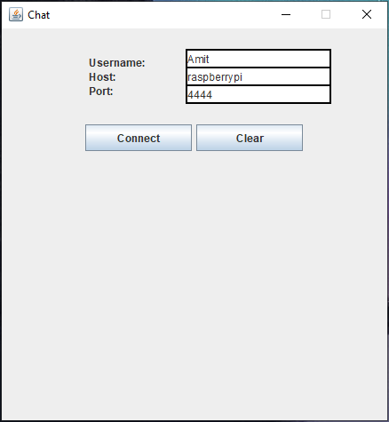
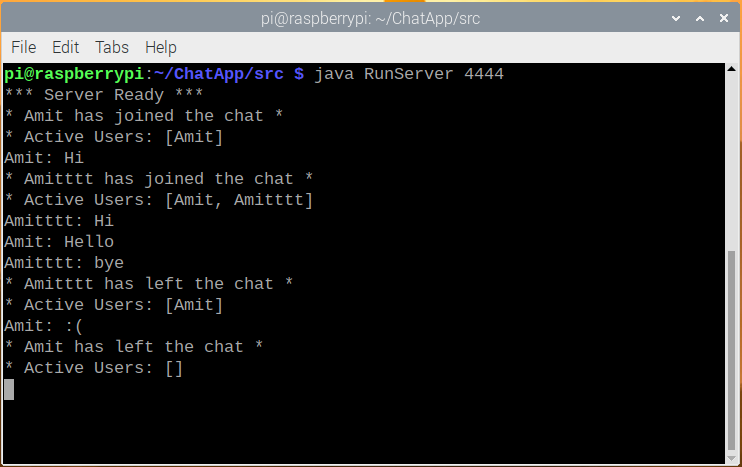

# ChatApp

A Client-Server chat room.

## Usage
Server:
- Compile 'src/server/*.java' on your JAVA environment.
- Run 'RunServer' class with a port as command-line argument.

Client:
- Compile 'src/client/*.java' on your JAVA environment.
- Run 'RunClient' class.

\

